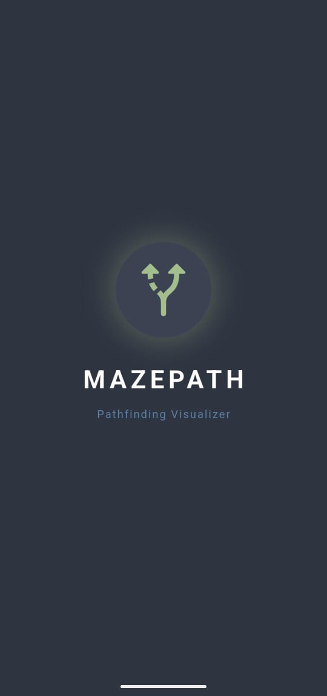
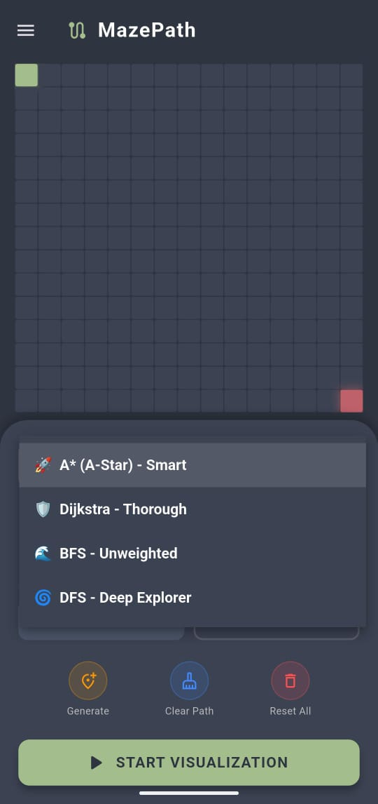
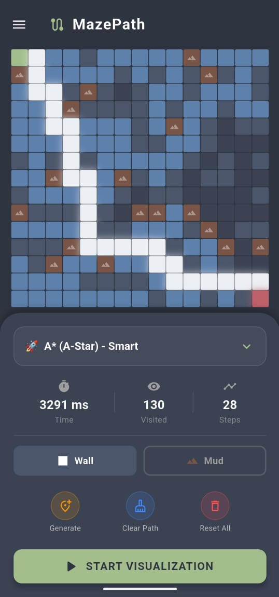
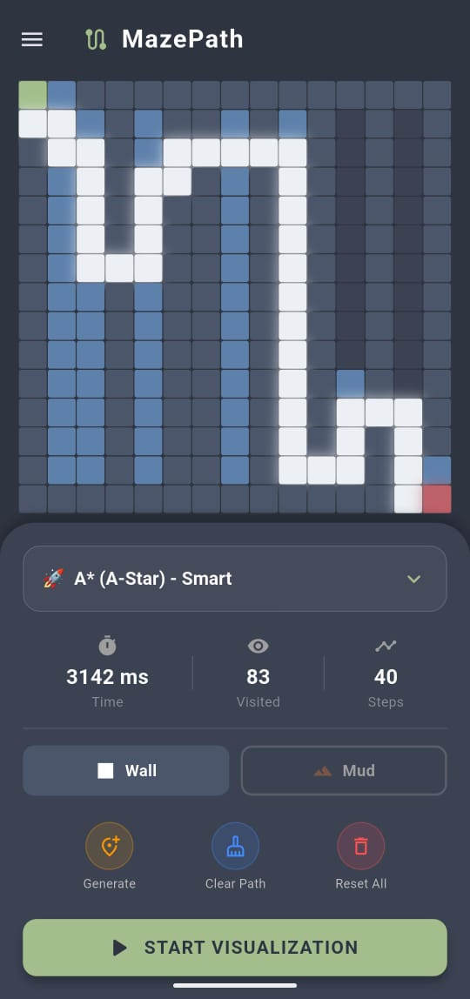
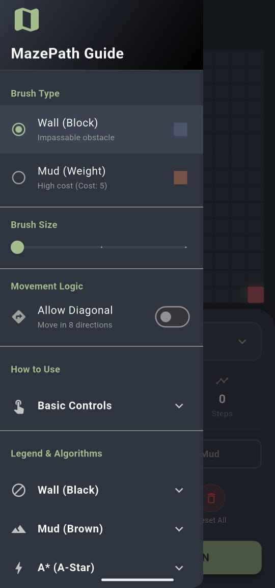

# 📍 MazePath - Advanced Pathfinding Visualizer

[](https://flutter.dev/)
[](https://dart.dev/)
[](https://pub.dev/packages/provider)
[](LICENSE)

**MazePath** is a powerful and interactive education tool built with Flutter to visualize how various pathfinding algorithms work. Unlike simple visualizers, MazePath supports **weighted terrain (Mud)**, **diagonal movement**, and sophisticated **maze generation algorithms**.

Designed to demonstrate concepts of Graph Theory and Artificial Intelligence pathfinding.

## ✨ Key Features

### 🧠 Algorithms Implemented
Includes the "Big 4" pathfinding algorithms for comprehensive comparison:
* **A* (A-Star) Search:** The industry standard. Smart, heuristic-based, and highly efficient. Supports weights.
* **Dijkstra's Algorithm:** The father of pathfinding. Guarantees the shortest path by exploring evenly. Supports weights.
* **Breadth-First Search (BFS):** Explores layer-by-layer. Guarantees shortest path on unweighted graphs.
* **Depth-First Search (DFS):** Aggressive exploration. Does not guarantee the shortest path (often produces "snake-like" routes).

### 🗺️ Map Generation & Interaction
* **Recursive Division Maze:** Generates complex, aesthetically pleasing mazes with corridors and rooms using recursive logic.
* **Random Noise Terrain:** Generates scattered obstacles and terrain for stress-testing.
* **Interactive Grid:** Drag-and-drop Start/End nodes. Draw walls directly on the screen.

### ⛰️ Advanced Terrain System
* **Walls (Black):** Impassable barriers.
* **Mud/Weight (Brown):** High-cost terrain. Passing through mud costs **5x** more than normal ground. Smart algorithms (A*/Dijkstra) will intelligently path around it, while BFS/DFS will ignore the weight.

### ⚙️ Customization
* **Diagonal Movement:** Toggle between Manhattan (4-direction) and Euclidean/Chebyshev (8-direction) movement logic.
* **Brush Size:** Adjustable brush size for drawing walls/terrain quickly.
* **Real-Time Stats:** Live tracking of **Execution Time (ms)**, **Visited Nodes**, and **Path Length**.

## 📱 Screenshots

| Splash | Algorithm Selection | Mud & Weights | Recursive Maze | Drawer |
|:---:|:---:|:---:|:---:|:---:|
|  |  |  |  |  |

## 🛠️ Tech Stack

* **Framework:** [Flutter](https://flutter.dev/)
* **Language:** [Dart](https://dart.dev/)
* **State Management:** [Provider](https://pub.dev/packages/provider) - for efficient UI rebuilding and game loop management.
* **Data Structures:** Priority Queues, HashSets, Stacks, and Queues for algorithm implementation.

## 📂 Project Structure
```
lib/
├── core/                        # Shared resources
│   ├── constants/
│   │   └── app_colors.dart      # App-wide color palette
│   └── enums/
│       ├── algorithm_type.dart  # Enum for A*, Dijkstra, BFS, DFS
│       └── node_type.dart       # Enum for Wall, Mud, Start, End, etc.
│
├── logic/                       # Business logic & Algorithms
│   ├── algorithms/
│   │   ├── a_star.dart          # A* implementation
│   │   ├── dijkstra.dart        # Dijkstra implementation
│   │   └── i_pathfinder.dart    # Interface/Contract (Optional)
│   └── models/
│       └── grid_node.dart       # Data model for a single cell
│
├── providers/                   # State Management
│   └── visualizer_provider.dart # Main controller (Logic + UI Binding)
│
├── ui/                          # Presentation Layer
│   ├── screens/
│   │   ├── home_screen.dart     # Main Dashboard & Visualization area
│   │   └── splash_screen.dart   # Initial loading screen
│   └── widgets/
│       ├── app_drawer.dart      # Side menu (Settings & Legend)
│       ├── grid_board.dart      # The interactive grid layout
│       ├── node_widget.dart     # Single cell visualizer
│       ├── result_dialog.dart   # Popup showing stats after run
│       └── stats_panel.dart     # (Optional) Helper for stats UI
│
└── main.dart                    # Entry point of the application
```

## 🚀 Getting Started

### Prerequisites
* Flutter SDK installed (Version 3.0 or higher)
* Dart SDK
* Android Studio / VS Code

### Installation

1.  **Clone the repository**
    ```bash
    git clone https://github.com/GigaFdlh/MazePath.git
    cd mazepath
    ```

2.  **Install dependencies**
    ```bash
    flutter pub get
    ```

3.  **Run the app**
    ```bash
    flutter run
    ```

## 🕹️ How to Use

1.  **Select a Brush:** Choose between **Wall** (Block) or **Mud** (Weighted) from the bottom dashboard.
2.  **Draw:** Swipe on the grid to create obstacles. You can also drag the **Start (Green)** and **End (Red)** nodes.
3.  **Generate (Optional):** Use the Generator menu to create a **Recursive Maze** or **Random Noise**.
4.  **Settings:** Open the Drawer (Menu) to toggle **Diagonal Movement** or change **Brush Size**.
5.  **Run:** Select an algorithm from the dashboard dropdown and press **Start Visualization**.

## 🤝 Contributing

Contributions are what make the open-source community such an amazing place to learn, inspire, and create. Any contributions you make are **greatly appreciated**.

1.  Fork the Project
2.  Create your Feature Branch (`git checkout -b feature/AmazingFeature`)
3.  Commit your Changes (`git commit -m 'Add some AmazingFeature'`)
4.  Push to the Branch (`git push origin feature/AmazingFeature`)
5.  Open a Pull Request

## 📄 License

Distributed under the MIT License. See `LICENSE` for more information.

---
<p align="center">
  Built with ❤️ by <strong>Giga Kurnia F</strong>
</p>